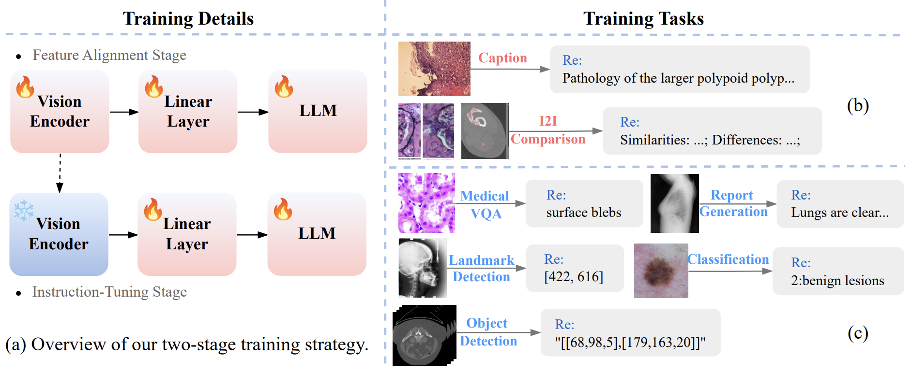
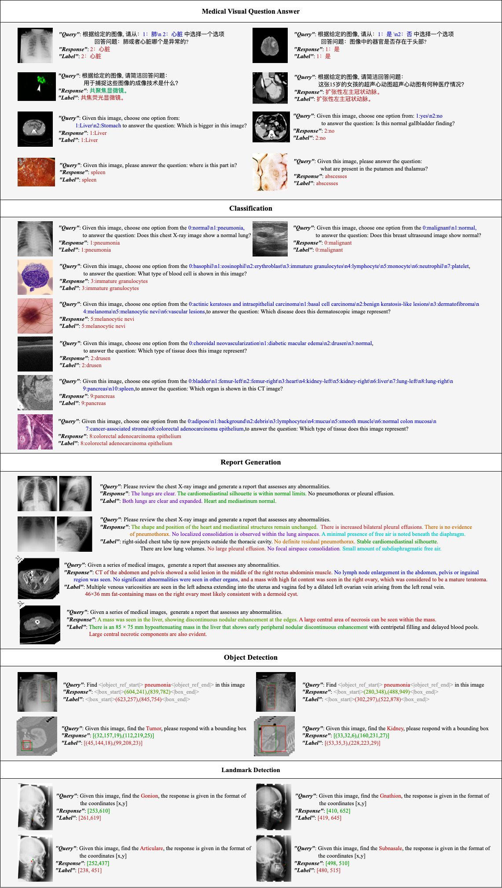

# [UMIT: Unifying Medical Imaging Tasks via Vision-Language Models](https://arxiv.org/pdf/2503.15892v1)

## Introduction

With the rapid advancement of deep learning, Vision-Language Models (VLMs) have become essential for medical image analysis. However, existing VLMs often focus on specific tasks or single imaging modalities, limiting their generalizability. To address this, we propose UMIT, a Unified Multi-modal, Instruction-guided Transformer for medical imaging tasks. UMIT supports visual question answering, disease detection, medical report generation, classification and landmark detection across multiple imaging modalities. It also operates in both English and Chinese, enhancing accessibility. UMIT adopts a two-stage training strategy: a feature alignment stage to align visual and textual features, and an instruction fine-tuning stage that employs various instructions to enable UMIT to share knowledge across multiple tasks.


## Data

Original dataset download URL and pre-processed datasets：

| Task              | Dataset Name | Link                                                                 | Pre-processed Datasets                              |
|-------------------|--------------|----------------------------------------------------------------------|----------------------------------------------------|
| **Feature Alignment** | PMC-OA       | [PMC-OA Beta](https://huggingface.co/datasets/axiong/pmc_oa_beta)    | [HuggingFace](https://huggingface.co/datasets/dz-osamu/PMC-OA) |
| **Feature Alignment**  | CM-VL-A   | https://huggingface.co/datasets/williamliu/ChiMed-VL | [HuggingFace](https://huggingface.co/datasets/dz-osamu/CM-VL-A)|
| **Medical VQA**  | VQA-RAD    | https://osf.io/89kps/ | [HuggingFace](https://huggingface.co/datasets/dz-osamu/VQA-RAD)|
| **Medical VQA**  | PathVQA    | https://huggingface.co/datasets/flaviagiammarino/path-vqa | [HuggingFace](https://huggingface.co/datasets/dz-osamu/PathVQA)|
| **Medical VQA**  | M3D-VQA    | https://huggingface.co/datasets/GoodBaiBai88/M3D-VQA |[HuggingFace](https://huggingface.co/datasets/dz-osamu/M3D-VQA)| 
| **Medical VQA**  | CM-VL-I     | https://huggingface.co/datasets/williamliu/ChiMed-VL | [HuggingFace](https://huggingface.co/datasets/dz-osamu/CM-VL-I)|
| **Medical VQA** & **Disease Detection** | SLAKE    | https://www.med-vqa.com/slake/ | [HuggingFace](https://huggingface.co/datasets/dz-osamu/Slake)|
| **Classification**  | MedMNIST    | https://medmnist.com/ | [HuggingFace](https://huggingface.co/datasets/dz-osamu/MedMNIST)|
| **Report Generation**  | IU-Xray  | https://drive.google.com/file/d/1c0BXEuDy8Cmm2jfN0YYGkQxFZd2ZIoLg/view | [HuggingFace](https://huggingface.co/datasets/dz-osamu/IU-Xray)|
| **Report Generation**  | PEIR GROSS  | https://github.com/nlpaueb/bioCaption | [HuggingFace](https://huggingface.co/datasets/dz-osamu/PEIR_GROSS)|
| **Report Generation**  | M3D-Cap  | https://huggingface.co/datasets/GoodBaiBai88/M3D-Cap | [HuggingFace](https://huggingface.co/datasets/dz-osamu/M3D-Cap)|
| **Disease Detection**  | RSNA    | https://www.rsna.org/rsnai/ai-image-challenge/rsna-pneumonia-detection-challenge-2018 | [HuggingFace](https://huggingface.co/datasets/dz-osamu/RSNA)|
| **Disease Detection**  | M3D-Seg    | https://huggingface.co/datasets/GoodBaiBai88/M3D-Seg | [HuggingFace](https://huggingface.co/datasets/dz-osamu/M3D-Seg)|
| **Landmark Detection**  | IEEE ISBI Challenge 2015 Dataset    | https://opendatalab.com/OpenDataLab/Cephalometric_X-ray_Image | [HuggingFace](https://huggingface.co/datasets/dz-osamu/IEEE_ISBI_Challenge_2015)|

## Evaluation
Quick Start:
```bash
git clone https://github.com/modelscope/ms-swift.git
cd ms-swift
pip install -e .
pip install qwen-vl-utils
```

Load checkpoint and eval dataset:
```bash
MAX_PIXELS=602112 swift infer --ckpt_dir "path/checkpoint" \
                              --val_dataset "path/test.jsonl" \
                              --result_dir "outputpath"
```
Our pre-trained model weights are available on Hugging Face Hub. You can access them via the following links:
| Model       | Link                     |
|-------------|---------------------------------------|
| UMIT-B     | [HuggingFace](https://huggingface.co/dz-osamu/UMIT-B) |
| Classification     | [HuggingFace](https://huggingface.co/dz-osamu/Classification) |
| Medical VQA     | [HuggingFace](https://huggingface.co/dz-osamu/VQA) |
| Report Generation     | [HuggingFace](https://huggingface.co/dz-osamu/Report_Generation) |
| Disease Detection     | [HuggingFace](https://huggingface.co/dz-osamu/Disease_Detection) |
| Landmark Detection    | [HuggingFace](https://huggingface.co/dz-osamu/Landmark_Detection) |

## Results
Here we show some example results from our model.


